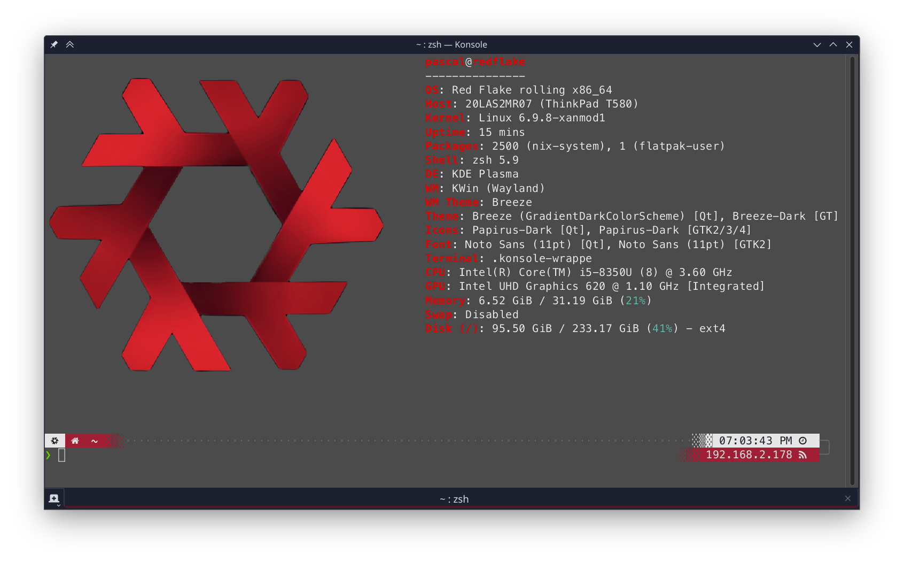
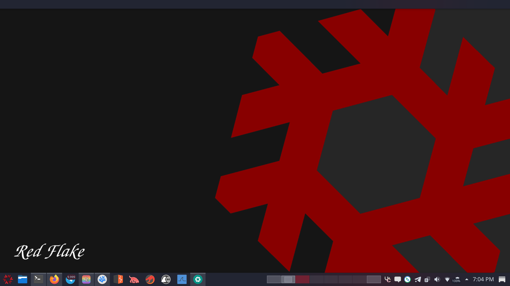
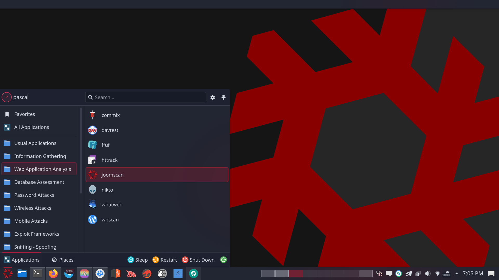

[](https://nixos.org)
&ensp;
[](#)
&ensp;
[](#)
&ensp;
[](#)

<br><br>

<h1 align="center">
    
   <br>
   Red-Flake Nix Flake
</h1>

<br><br><br>

# Installation

<br>

1. Bootup any NixOS live CD
2. Install Red Flake:

```bash
bash -c "$(curl -s https://raw.githubusercontent.com/Red-Flake/red-flake-nix/main/install.sh)"
```

<br><br>

# Rebuilding

<br>

Rebuild the already installed system from the flake

```bash
sudo nixos-rebuild switch --install-bootloader --flake 'github:Red-Flake/red-flake-nix#redflake' --option eval-cache false
```

<br><br>

# Showcase

<br>

## fastfetch



## KDE about this system


## KDE desktop



<br>

## KDE start menu



<br><br>

# Contributing

Community contributions are always welcome through GitHub Issues and
Pull Requests.

<br><br>

# License

Red-Flake is licensed under the [GPL License](LICENSE).
