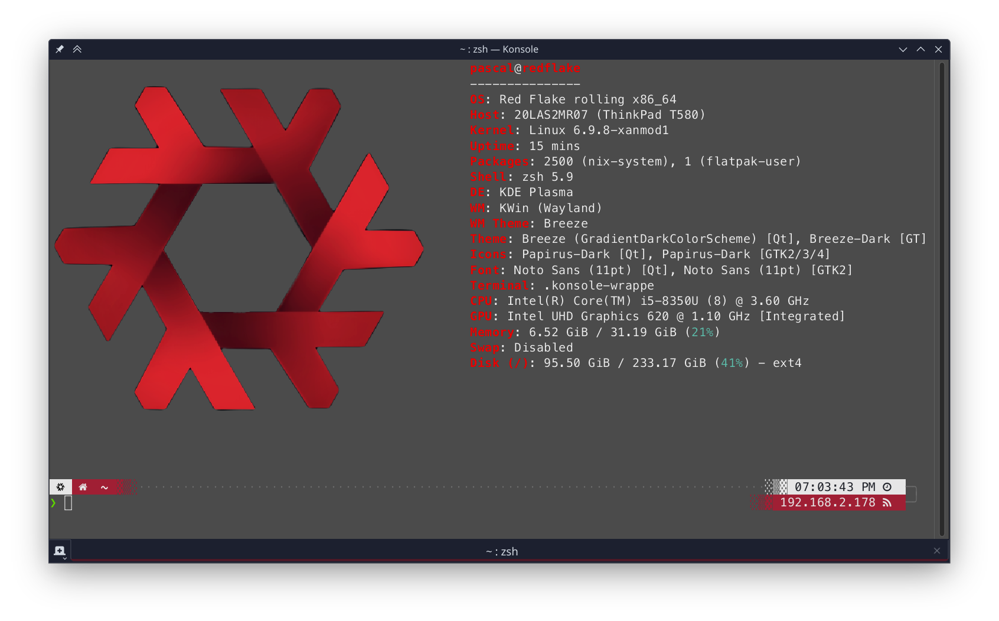
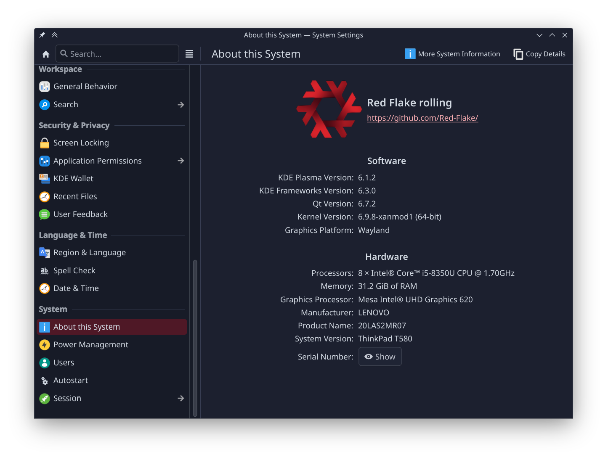
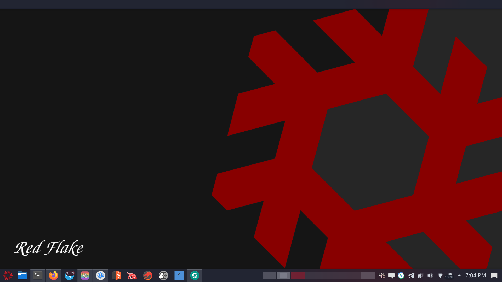
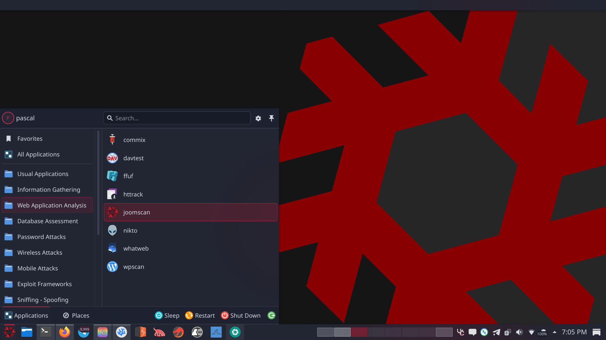

<h1 align="center">
  
  <div>Red-Flake Nix</div>
  <br>
  <div>
    <a href="https://github.com/Red-Flake/red-flake-nix/issues">
        
    </a>
    <a href="https://github.com/Red-Flake/red-flake-nix/stargazers">
        
    </a>
    <a href="https://github.com/Red-Flake/red-flake-nix">
        
    </a>
    <a href="https://github.com/Red-Flake/red-flake-nix/blob/main/LICENSE">
        
    </a>
    <a href="https://nixos.org">
        
    </a>
     <a href="https://github.com/nix-community/home-manager">
        
    </a>
     <a href="https://kde.org/de/announcements/megarelease/6">
        
    </a>
     <a href="https://img.shields.io/github/actions/workflow/status/Red-Flake/red-flake-nix/ci.yml">
        
    </a>
  </div>
  <a href="https://builtwithnix.org">
      
  </a>
</h1>

<br><br><br>

# Installation

<br>

1. Bootup any NixOS live CD
2. Install Red Flake (run as root, do not use sudo):

```bash
bash <(curl -L https://raw.githubusercontent.com/Red-Flake/red-flake-nix/main/install.sh)
```

<br><br>

# Rebuilding

<br>

Rebuild the already installed system from the flake

```bash
redflake-rebuild
```

<br><br>

# Features

<br>

- custom NixOS flake using NixOS 25.11
- NixOS home-manager
- encrypted root on ZFS
- Impermanence (non-persistent root on tmpfs) with persistence on `/persist`
- GRUB bootloader with EFI support & theme
- performance tweaks
- custom Red-Flake themes
- custom Red-Flake boot logo
- custom Red-Flake wallpaper
- customized KDE desktop
- customized KDE start menu
- pre-configured, ready-to-use tools for penetration testing, red teaming & CTFs
- additional standalone tools in `/usr/share/tools`
- various wordlists in `/usr/share/wordlists`
- various webshells in `/usr/share/webshells`
- PayloadsAllTheThings in `/usr/share/payloads/payloadsallthethings`
- exploitdb in `/usr/share/exploits/exploitdb`
- customized zsh shell with oh-my-zsh
- support for Docker, LXC, KVM & VirtualBox
- postgres & neo4j databases for metasploit & bloodhound
- provide automatic provisioning for
   - Zsh
   - KDE Plasma
   - metasploit framework
   - postgresql
   - BloodHound
   - Neo4j
   - Burp Suite
   - Firefox
   - ... and more

<br><br>

# Showcase

<br>

## fastfetch



## KDE about this system



## KDE desktop



<br>

## KDE start menu



<br><br>

# Contributing

Community contributions are always welcome through GitHub Issues and
Pull Requests.

- Note: `.pre-commit-config.yaml` is generated by `pre-commit-hooks.nix` and is
  intentionally gitignored.
- CI runs the pre-commit suite (treefmt, shellcheck, statix, deadnix) via the
  flake devShell. treefmt formats Nix (`nixpkgs-fmt`), shell (`shfmt`), and
  Markdown (Prettier).

<br><br>

# License

Red-Flake is licensed under the [GPL License](LICENSE).
